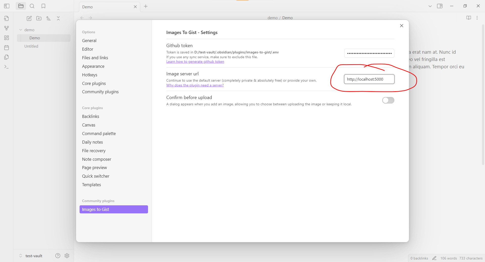

# Images to Gist server

Used by [obsidian-images-to-gist](https://github.com/singh-inder/obsidian-images-to-gist) plugin to serve images.

## Run Locally

- The simplest way to run the server locally is using docker

  ```
  docker run -d -p 5000:5000 ghcr.io/singh-inder/images-to-gist-server:latest
  ```

- Or you can clone the repo, install dependencies and run `npm run dev`. Server has been tested with nodejs version defined in [Dockerfile](Dockerfile).
  By default, server runs on PORT `5000`, but you can override it by creating a `.env` file in the project root and add PORT variable

  ```
  PORT=8080
  ```

### Update image server url in obsidian

Whichever method you use to run the server locally, make sure to update the image server url inside [images-to-gist](https://github.com/singh-inder/obsidian-images-to-gist) plugin settings



## Deploying to Production

1. [Caddy](https://caddyserver.com) serves as the reverse proxy in the production environment.

   The following environment variables are required for Caddy:

   ```sh
   # The domain name that the Caddy server should listen to (e.g., images.com). same as nginx server_name
   DOMAIN=

   # The email address to be registered with Let's Encrypt for obtaining SSL certificates.
   CERT_EMAIL=
   ```

2. Utilize Docker Compose to manage and run containers on your production server.

   ```
   docker compose up -d
   ```

3. Make sure to update the image server url inside [images-to-gist](https://github.com/singh-inder/obsidian-images-to-gist) plugin settings

## Support

If you'd like to help cover the costs of hosting the image server or fuel my late-night coding sessions with more coffee:

[](https://www.buymeacoffee.com/_inder1)
